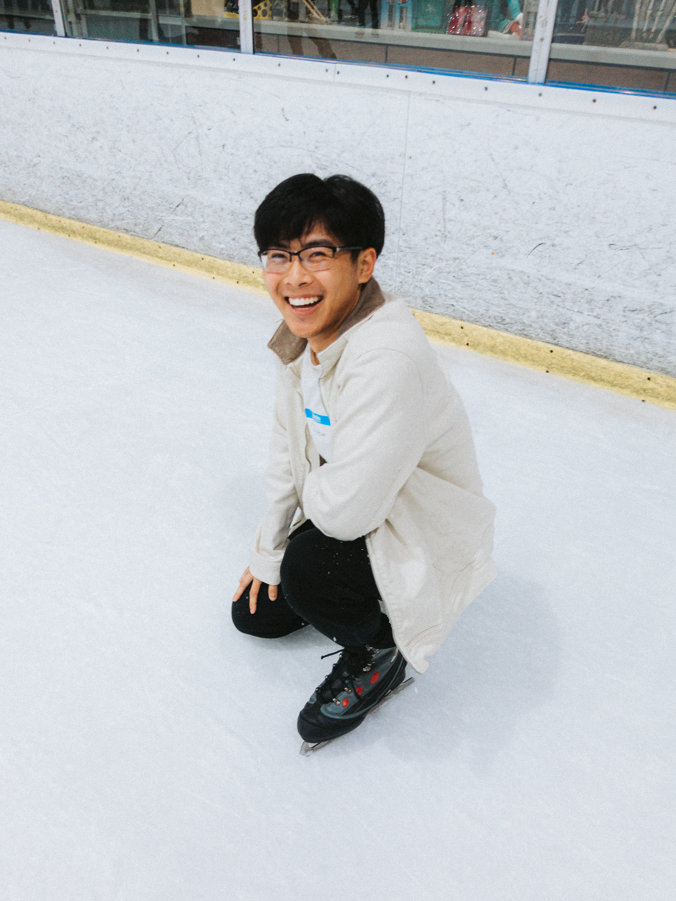

# Justin's User Page

## Picture of me :D


## As a programmer
To describe my experience as a programmer, I have on many course projects up to this point and have also worked on a few projects outside of the classroom. I have worked in **C++, Java,** and **Python** and also learned **HTML, CSS,** and **JS**. If you want to know my favoriate programming language, then visit [this page](README.md). I have worked on creating neural networks before that can be trained and be used to classify new test images. This was related to this [experiment](http://ufldl.stanford.edu/housenumbers/) The code is shown below...
```
class Net(nn.Module):
    def __init__(self, n_labels=5):
        super().__init__()
        # --------------- YOUR CODE HERE ---------------
        self.convol1 = nn.Conv2d(3, 5, 4, 2)
        self.convol2 = nn.Conv2d(5, 10, 4, 1)
        self.convol3 = nn.Conv2d(10, 20, 4, 1)
        self.convol4 = nn.Conv2d(20, 40, 4, 1)

        self.linear = nn.Linear(1440, 5)

        self.relu = nn.ReLU()
        self.flatten = nn.Flatten()


    def forward(self, x):
        # --------------- YOUR CODE HERE ---------------
        x = self.relu(self.convol1(x))
        x = self.relu(self.convol2(x))
        x = self.relu(self.convol3(x))
        x = self.relu(self.convol4(x))

        x = self.flatten(x)
        x = self.linear(x)
        
        return x

net = Net()
print(net)
```

## As a person
A few things that I like to do are shown in the list below...
- Snowboarding
- Drawing
- Swimming
- Cooking / Baking

I also like watching JoJo's Bizarre Adventure and one quote that stood out would be...
> Nyohoho

Below is a picture of the character that said this quote, Gyro:


I have three favorite colors which can be ranked as follows...
1. Pastel Pink
2. Sky Blue
3. Red

## Styling Requirements
- [x] Headings
- [x] Styling text
- [x] Quoting text
- [x] Quoting code
- [x] External links
- [x] Section links
- [x] Relative links
- [x] Ordered list
- [x] Unordered list
- [x] Task list
- [x] Images
